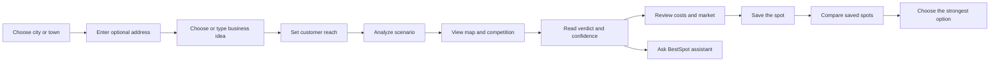
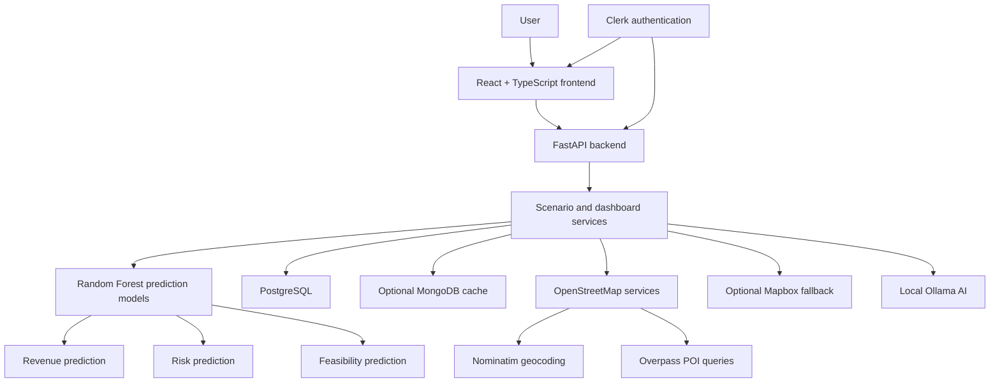
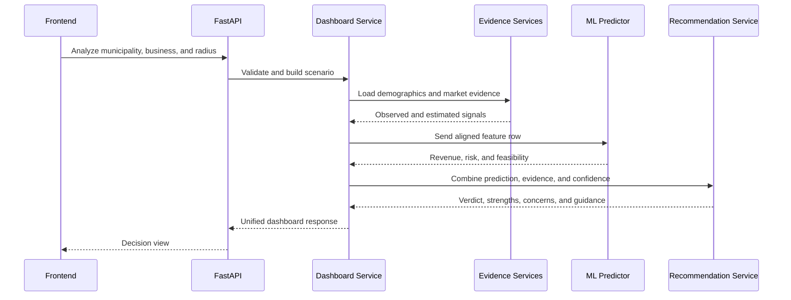

# BestSpot.biz — Product and System Design

**Project:** Group 14 Capstone
**Team:** Girish, Shubham, Jainish, and Kalp
**Document status:** Current implementation design
**Last updated:** July 28, 2026

## 1. Product identity

The project and product name is **BestSpot.biz**. The shorter name
**BestSpot** is used throughout this document.

## 2. Product summary

BestSpot is a location intelligence tool for people planning to open a business
in Ontario. It helps a user answer one main question:

> Will this business idea work at this location, and is there a stronger
> location nearby?

The user provides a city or town, an optional exact address, a business idea,
and a customer reach radius. BestSpot combines demographic information, public
map evidence, market signals, cost estimates, and machine-learning predictions
into one clear decision view.

The product is designed as **decision support**, not as a guarantee of business
success.

## 3. Problem

Choosing a business location normally requires information from many separate
sources. A small business owner may need to research:

- Nearby competitors
- Local population and customer groups
- Demand and activity in the area
- Commercial lease costs
- Expected business risk
- Other cities or locations with better conditions

This process takes time and can be difficult for users without market research
experience. The information may also use different formats and may not be easy
to compare.

BestSpot brings the main signals into one workflow and explains the result in
plain language.

## 4. Target users

### Primary users

- First-time business owners
- Small business owners planning a new branch
- Entrepreneurs comparing Ontario locations
- Users who need an early feasibility check before signing a lease

### Secondary users

- Business advisors
- Economic development teams
- Commercial real estate professionals
- Students and researchers studying location decisions

## 5. Product goals

1. Help a user create a location scenario in about one minute.
2. Show nearby competition on a clear map.
3. Turn market evidence into an understandable feasibility verdict.
4. Explain the strengths, concerns, and confidence behind the verdict.
5. Let users compare possible locations using the same scoring method.
6. Keep observed information separate from estimates and model predictions.
7. Let users ask follow-up questions about the active scenario.

## 6. Non-goals

BestSpot does not:

- Guarantee revenue, profit, or business success.
- Replace legal, financial, lease, or professional business advice.
- Provide complete commercial listing coverage.
- Claim that all map or market information is real-time.
- Treat estimated values as directly observed facts.
- Make the final location decision for the user.

## 7. Design principles

### 7.1 Answer first

The user sees the feasibility score and recommendation before detailed charts
or technical information.

### 7.2 Map before data tables

Location decisions are spatial. The map is the main visual starting point.

### 7.3 Plain language

Labels such as “What helps this spot” and “What needs a closer look” are used
instead of technical model terms.

### 7.4 Compare on equal terms

Saved locations use the same scoring structure so the user can make a fair
comparison.

### 7.5 Show uncertainty

Observed, derived, estimated, and modelled values are separated. Confidence and
limitations are visible to the user.

### 7.6 AI supports the evidence

The AI assistant explains the active scenario. It does not replace the
deterministic analysis or silently change the score.

### 7.7 Graceful failure

Optional systems such as MongoDB, Mapbox, OpenStreetMap services, and Ollama
must not cause unrelated parts of the product to fail.

## 8. Main user journey

### 8.1 Scenario setup

The user provides four inputs:

| Input | Required | Rules |
|---|---:|---|
| Municipality | Yes | Ontario city or town |
| Exact storefront address | No | Falls back to the city centre |
| Business idea | Yes | Catalog option or supported free-text idea |
| Customer reach | Yes | 1 to 25 kilometres |

The default demonstration scenario is an **Indian Grocery Store in Kitchener
with a 5 km customer reach**.

### 8.2 Analysis loading state

The loading screen tells the user what the system is doing:

- Building the decision view
- Loading the map
- Checking competition
- Checking demand
- Preparing cost information

This reduces uncertainty during longer data or model calls.

### 8.3 Map and competition

The map view shows:

- The selected address or city-centre anchor
- The selected customer reach
- Nearby same-category competitors when public evidence is available
- Transit and activity points when available
- Competition count and nearest competitor distance
- Reachable population
- Demand score
- Estimated monthly lease range

The interface labels the map as **Live market evidence** only when live
OpenStreetMap evidence is available. Otherwise, it uses the more general
**Market evidence** label.

### 8.4 Verdict

The verdict view shows:

- Feasibility score out of 100
- Recommendation label
- Plain-language decision summary
- Predicted monthly net revenue
- Predicted business risk
- Decision confidence
- Major strengths
- Major concerns
- Suggested next action
- Local market profile

The local market profile includes population, median household income,
population density, students, families, and retirees.

### 8.5 Costs and market

The costs and market view presents:

- Demand pressure
- Competition pressure
- Rent pressure
- Foot-traffic proxy
- Operating profile ranges

Estimated values are presented as ranges where possible. This avoids showing a
single estimate as false precision.

### 8.6 Location comparison

Users can save scenarios and rank them together. Each comparison includes:

- Location label
- Overall score
- Predicted feasibility
- Risk
- Demand
- Competition
- Lease estimate
- Main trade-off

Saved scenarios are separated by authenticated user when Clerk authentication
is enabled.

### 8.7 AI assistant

The BestSpot assistant receives the active municipality, business type, radius,
evidence, credibility information, and recommendation context.

Example questions include:

- Why is this scenario recommended?
- What is the biggest risk?
- What can I change to improve feasibility?
- Which values are observed and which are estimated?
- How reliable is this prediction?

The response can show the signals it used and the limits of the available
information.

### 8.8 Evidence and system information

The advanced view contains:

- Business idea resolution details
- Scenario support coverage
- Observed inputs
- Estimated or modelled inputs
- Evidence confidence
- Model status
- System validation

This information stays outside the main decision flow but remains available for
users who want to inspect the result.

## 9. System architecture

## 10. Frontend design

### 10.1 Technology

- React 19
- TypeScript
- Vite
- Tailwind CSS
- Radix-based UI components
- TanStack Query
- Wouter routing
- Leaflet and Mapbox GL support
- Recharts
- Framer Motion
- Clerk authentication components

### 10.2 Main interface structure

The application has two main states.

#### Scenario creation state

- Brand and Ontario region label
- Short problem statement
- Four-input scenario form
- Product value preview

#### Analysis workspace

- Active location ribbon
- Customer reach control
- Export action
- Five main tabs:
  1. Map & competition
  2. Verdict
  3. Costs & market
  4. Compare spots
  5. Data & setup
- Floating BestSpot assistant

### 10.3 Visual language

The interface uses a warm, professional style designed for business owners
rather than data scientists.

| Token | Value | Purpose |
|---|---|---|
| Background | Warm off-white | Reduces visual fatigue |
| Foreground | Dark warm brown | Main text and controls |
| Primary | Strong coral-red | Main actions and location identity |
| Accent | Deep green | Positive and trusted signals |
| Border | Soft warm grey | Quiet grouping |
| Radius | 0.75 rem base | Friendly card and control shapes |

### 10.4 Typography

- **Public Sans:** interface text and controls
- **Fraunces:** major scores, verdicts, and display headings
- **Spline Sans Mono:** technical status and system information

The display font gives important decisions more visual weight. The sans-serif
font keeps forms and supporting text easy to read.

### 10.5 Status colours

- Green: positive, ready, low risk, or stronger evidence
- Amber: moderate, watch, or limited confidence
- Red: high risk, concern, unavailable, or failed check
- Neutral: unavailable or informational

Colour is supported by text labels and is not intended to be the only status
signal.

### 10.6 Responsive behaviour

The desktop design uses:

- A wide map with a right-side insight rail
- Multi-column verdict and comparison cards
- A floating AI assistant

At smaller widths:

- Columns collapse into one or two columns
- Tabs become horizontally scrollable
- The insight rail moves below the map
- The verdict score stacks above its explanation
- The AI panel fits within the viewport

## 11. Backend design

### 11.1 Technology

- Python
- FastAPI
- Pydantic
- SQLAlchemy
- Alembic
- PostgreSQL
- Optional MongoDB cache
- scikit-learn
- pandas
- joblib
- Ollama

### 11.2 Service structure

The backend separates responsibilities into services:

- Dashboard orchestration
- Scenario feature building
- ML prediction
- Prediction consistency checks
- Competition evidence
- Demand evidence
- Lease-cost evidence
- Geospatial market context
- Business idea resolution
- Recommendation generation
- Explanation generation
- Credibility scoring
- Operating profile generation
- Scenario history and comparison
- Report generation
- System validation

### 11.3 Analysis flow

The map request can load separately from the main dashboard analysis so a map
service delay does not block the full decision result.

## 12. Data design

### 12.1 Data categories

| Category | Examples | Treatment |
|---|---|---|
| User input | City, business idea, radius, address | Direct input |
| Observed | Statistics Canada census fields | Labelled as observed |
| Public map evidence | OpenStreetMap POIs and addresses | Labelled by availability and source |
| Derived | Density, customer reach, pressure indexes | Formula-based and explained |
| Proxy estimate | Demand, lease, foot traffic | Clearly labelled as estimated |
| Model prediction | Revenue, risk, feasibility | Labelled as predicted |
| AI output | Explanations and operating profile | Supporting guidance only |

### 12.2 Primary data sources

- Processed Statistics Canada 2021 Census information for Ontario
  municipalities
- OpenStreetMap Nominatim for geocoding
- OpenStreetMap Overpass for public business, competitor, transit, and activity
  points
- Seed evidence catalogs for competition, demand, and lease estimates
- User-entered scenario inputs

Mapbox is optional and is used only as a fallback for marker address
resolution when OpenStreetMap does not provide enough address information.

### 12.3 PostgreSQL

PostgreSQL stores:

- Demographic zone records
- Saved scenario history
- User ownership for saved scenarios when authentication is active
- Key scores and evidence values needed for later comparison

The schema is managed with Alembic migrations.

### 12.4 MongoDB

MongoDB is an optional cache for:

- Operating profiles
- Business resolution
- Geospatial market results

MongoDB is not a required source of truth. If it is unavailable, the related
service continues without the cache.

## 13. Machine-learning design

### 13.1 Models

The current system uses three scikit-learn Random Forest models:

| Model | Type | Output |
|---|---|---|
| Revenue model | Random Forest regressor | Predicted monthly net revenue |
| Feasibility model | Random Forest regressor | Score from 0 to 100 |
| Risk model | Random Forest classifier | Low, medium, or high risk |

### 13.2 Shared feature pipeline

Training and live prediction use the same feature-building pipeline. This
reduces the risk that training data and production inputs use different column
names, formats, or calculations.

The model-status and feature-alignment checks detect missing artifacts and
schema drift.

### 13.3 Consistency guard

After prediction, consistency rules check for conflicting outputs. For example,
a very low feasibility score should not be presented beside an unexplained
strong recommendation.

Any adjustment or warning is included in the prediction metadata.

### 13.4 Model limits

The present models are trained using generated scenarios built from census
signals, business assumptions, and formula-based targets. The outputs are useful
for prototype scenario comparison, but they are not validated commercial
forecasts.

The system must continue to:

- Label predictions clearly
- Show confidence and proxy dependency
- Avoid claims of guaranteed revenue
- Keep the model version with each prediction
- Retrain whenever the shared feature pipeline changes

## 14. AI design

### 14.1 Provider

The AI features use a locally hosted Ollama model. The model can be changed
through approved environment configuration.

### 14.2 AI-supported features

- Free-text business idea resolution
- Dynamic OpenStreetMap tag suggestions
- Operating profile generation
- Scenario question answering

### 14.3 Structured output

Business resolution and operating profiles use schema-constrained JSON when
the installed Ollama version supports it. This improves type safety and reduces
invalid responses.

### 14.4 AI safety rules

- User text is treated as untrusted input.
- Prompt boundaries separate instructions from user content.
- Arbitrary model names are rejected unless allowed.
- Deterministic evidence remains the source of the score.
- AI responses include limitations when available.
- The application shows an unavailable state when Ollama or its model is not
  ready.

## 15. API design

Important endpoints include:

| Method | Endpoint | Purpose |
|---|---|---|
| `GET` | `/health` | Basic service health |
| `POST` | `/analyze-scenario` | Unified scenario analysis |
| `POST` | `/geo/market-map` | Map and POI evidence |
| `POST` | `/geo/site-address-analysis` | Exact-address analysis |
| `POST` | `/business/resolve` | Free-text business resolution |
| `POST` | `/business/operating-profile` | Operating ranges and assumptions |
| `POST` | `/recommendation/decision` | Recommendation and guidance |
| `POST` | `/ml/prediction-credibility` | Confidence and evidence categories |
| `GET` | `/ml/model-status` | Model artifact status |
| `POST` | `/scenario-history/save` | Save a scenario |
| `GET` | `/scenario-history` | List saved scenarios |
| `POST` | `/scenario-history/compare` | Rank saved scenarios |
| `POST` | `/scenario/location-comparison` | Compare requested locations |
| `POST` | `/ai/scenario-chat` | Ask about the active scenario |
| `POST` | `/reports/feasibility` | Export a feasibility report |
| `GET` | `/validation/system` | Run system checks |

Pydantic schemas validate request and response data. Scenario radius is limited
to 1–25 km.

## 16. Authentication and security

### 16.1 Authentication

Clerk authentication is optional during local development. When configured:

- The frontend sends the Clerk session token.
- The backend verifies the token using Clerk's issuer and JWKS.
- Protected endpoints require a valid user.
- Saved scenario history is separated by Clerk user ID.

Production must not run with authentication disabled.

### 16.2 API protection

The backend includes:

- CORS origin allowlisting
- Content Security Policy for JSON API routes
- `X-Content-Type-Options`
- `X-Frame-Options`
- Referrer policy
- HSTS
- Optional per-IP rate limiting
- Sanitized error responses

### 16.3 Secret handling

Database credentials, Clerk configuration, MongoDB connection strings, Mapbox
tokens, and AI settings belong in environment files. Real secrets must never be
committed.

The required operator actions are documented in [SECURITY.md](SECURITY.md).

## 17. Reliability and fallback behaviour

| Failure | Expected behaviour |
|---|---|
| ML artifacts missing | Prediction endpoints return a clear `503 models_unavailable` response |
| OpenStreetMap map request fails | Main scenario result remains available; map can be retried |
| Live competitor points unavailable | No fake competitor markers are created |
| Exact address cannot be resolved | User receives an address status or can use the city centre |
| MongoDB unavailable | Cache is skipped; core service continues |
| Ollama unavailable | AI features show an unavailable state |
| Mapbox token missing | OpenStreetMap addresses remain primary; optional fallback is skipped |
| Unexpected backend error | Full detail is logged server-side; client receives a safe message |

## 18. Testing and quality

The backend test suite currently covers:

- Health and smoke checks
- Authentication on public and protected routes
- Security headers
- Rate limiting
- AI prompt and model safety
- Business idea matching
- Message bus registration and history

Additional high-value tests should cover:

- Full scenario analysis with stable fixtures
- Exact-address fallback behaviour
- Live and cached geospatial responses
- Scenario ownership and comparison
- ML feature alignment
- Frontend critical-path component tests
- End-to-end demo flow
- Accessibility checks

## 19. Deployment design

The production design requires:

- A built React frontend served over HTTPS
- A FastAPI backend behind a trusted reverse proxy
- PostgreSQL with a least-privilege application user
- Model artifacts delivered through approved shared storage or object storage
- Correct production CORS origins
- Clerk authentication enabled
- Rate limiting enabled and tuned
- `DEBUG=false`
- Alembic migrations applied

MongoDB, Mapbox, and Ollama depend on the chosen deployment environment and may
remain optional.

Detailed setup and deployment instructions are in:

- [SETUP.md](SETUP.md)
- [DEPLOYMENT.md](DEPLOYMENT.md)
- [SECURITY.md](SECURITY.md)

## 20. Known limitations

1. The product currently focuses on Ontario.
2. Census information is based on the processed 2021 dataset.
3. Public OpenStreetMap coverage can be incomplete.
4. Lease, demand, and foot-traffic information may use seeded or proxy values.
5. The ML models use generated training scenarios and require real commercial
   outcome data for stronger validation.
6. AI quality depends on the installed Ollama model and local hardware.
7. The in-process rate limiter is per backend worker and is not a shared
   distributed limiter.
8. Large model artifacts are not stored directly in the Git repository.
9. The system supports early location comparison, not a complete business plan.

## 21. Future design direction

### Near term

- Add stable end-to-end demo fixtures.
- Improve exact-address support in saved scenarios.
- Add frontend automated tests.
- Improve accessible labels, focus states, and keyboard testing.
- Package model artifacts through a reproducible release process.

### Medium term

- Connect verified commercial lease listings.
- Add broader business directory coverage.
- Add measured pedestrian or mobility information.
- Add location-level census and neighbourhood data.
- Add comparison filters and shareable reports.
- Add model monitoring and prediction drift checks.

### Long term

- Train models on real business outcome data.
- Support provinces outside Ontario.
- Add time-based market trend analysis.
- Add collaboration between owners and advisors.
- Provide decision audit history for every saved recommendation.

## 22. Product success measures

BestSpot should be considered successful when:

- A new user can create a scenario without training.
- The first useful result appears within an acceptable wait time.
- Users understand why a location received its score.
- Users can identify which values are observed and which are estimated.
- Users can compare at least three locations without changing their method.
- AI answers remain tied to the active scenario.
- Optional service failures do not hide the core verdict.
- Users understand that the result supports, but does not replace, professional
  business research.
